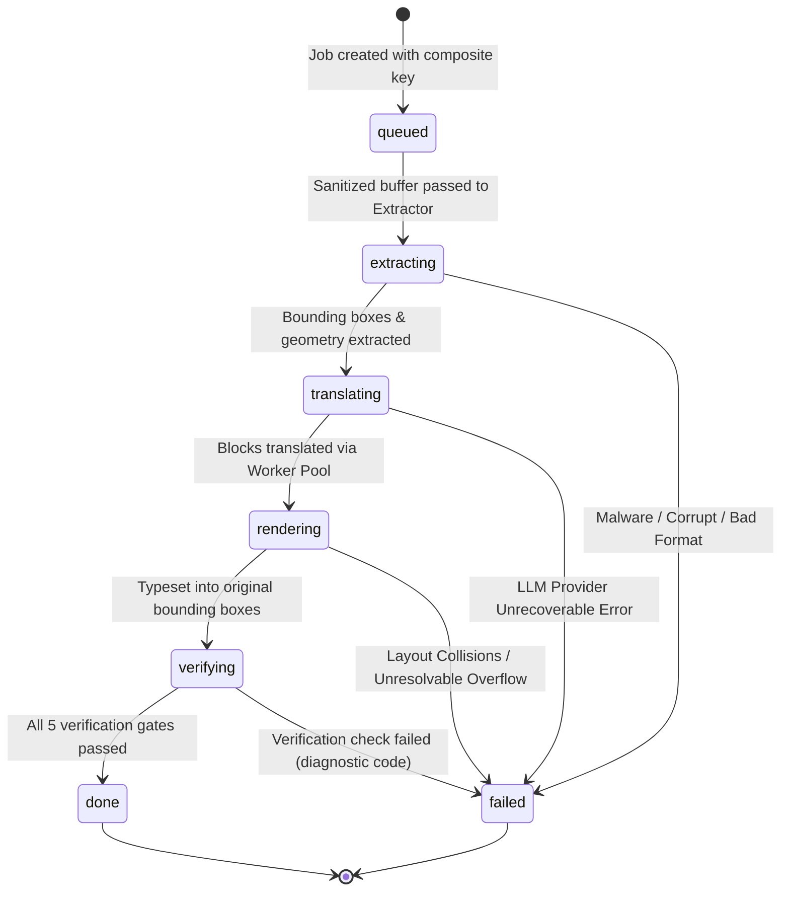

# DESIGN.md — Certified Translation Pipeline Architecture

## System Overview & Objectives
VerifyLingua is an enterprise legal-tech document translation platform certified under USCIS 8 CFR § 103.2 and ATA standards.
This design guarantees:
1. **Mathematical Isolation**: Every translation artifact is identified by a composite cryptographic key `(document_content_hash, source_lang, target_lang, pipeline_version, options_hash)`. Two different target languages for the same document never share a storage path, URL, or cached state.
2. **Deterministic Orchestration**: State-machine-driven worker pool with bounded concurrency, retry with exponential backoff, and in-flight deduplication.
3. **Strict Layout Preservation**: Bounding-box-constrained typesetting, dynamic font scaling, zero overlap, and intact preservation of official seals, signatures, and timestamps.
4. **Mandatory Automated Verification**: A 5-point verification stage running prior to completion that enforces target language detection, token preservation, block integrity, and boundary compliance.

---

## Section A: Identity and Caching Architecture

### 1. Composite Key Definition
Every translation request derives a deterministic 256-bit identifier:
```text
compositeKey = sha256(
  content_buffer_sha256 + ":" +
  normalized_source_lang + ":" +
  normalized_target_lang + ":" +
  pipeline_version + ":" +
  options_sha256
)
```
- `content_buffer_sha256`: Hexadecimal SHA-256 hash of the uploaded source file bytes.
- `normalized_source_lang`: ISO-639-1 code in lowercase (`en`, `es`, `fr`, `de`).
- `normalized_target_lang`: ISO-639-1 code in lowercase (`en`, `es`, `fr`, `de`).
- `pipeline_version`: Monotonically incremented integer (`"v2"`). Any change to OCR extraction, layout rules, or models updates this version.
- `options_sha256`: Hexadecimal hash of normalized options (service tier, formatting register, strict layout flag).

### 2. Storage Path Hierarchy
No artifact is ever stored under raw `jobId` or raw `sourceFilename`.
Artifacts are stored under:
```text
artifacts/{content_sha256}/{source_lang}_{target_lang}_{pipeline_version}/output.{ext}
artifacts/{content_sha256}/{source_lang}_{target_lang}_{pipeline_version}/blocks.json
artifacts/{content_sha256}/{source_lang}_{target_lang}_{pipeline_version}/verification.json
```
- Re-translating the same document to Language A writes to `artifacts/{hash}/en_es_v2/...`.
- Re-translating the same document to Language B writes to `artifacts/{hash}/en_fr_v2/...`.
- Overwrites between different languages are physically impossible by namespace construction.

### 3. Serving & HTTP Cache-Control Semantics
- Inline preview routes (`/api/translate/download/${jobId}?inline=true` and `/api/jobs/${jobId}/preview`):
  - Must return `Cache-Control: private, no-cache, no-store, must-revalidate`.
  - Must include `ETag: "${compositeKey}"` and `Vary: Accept-Encoding`.
  - Must include `X-VerifyLingua-Composite-Key: "${compositeKey}"`.
- Content-addressed artifact downloads:
  - URLs including the explicit content-hash and target language (e.g., `/api/artifacts/${compositeKey}/file.${ext}`) may be cached with `Cache-Control: private, immutable, max-age=86400`.
- Browser iframe or image reloading will never receive stale data from another language.

### 4. Legitimate Reuse Semantics
- If a client uploads Document X with Target Language A, and later uploads Document X with Target Language A again under identical pipeline version and options:
  - The composite key matches identically.
  - The orchestrator recognizes an existing completed artifact in the storage bucket / DB.
  - The cached verified result is returned instantly without incurring duplicate LLM API costs or processing delays.
  - This is declared as **legitimate cache reuse**. It is differentiated from the bug because the target language is a primary component of the key.

---

## Section B: Job Model and Orchestration

### 1. Job Lifecycle State Machine
Every translation request executes through strict states:


### 2. In-Process Bounded Worker Pool
To suit the Next.js / Node.js 22 runtime without requiring heavy Redis/RabbitMQ infrastructure:
- An in-process `WorkerPool` with concurrency limit controlled by `CONCURRENT_TRANSLATION_LIMIT` (default: 4 concurrent jobs).
- Each job splits page extraction and block batches into discrete units.
- Per-unit execution:
  - Timeout: 45 seconds per batch.
  - Retries: 3 attempts with exponential backoff (`300ms`, `600ms`, `1200ms`) on HTTP 429 or network errors.
- Assembly: Final document is assembled only when all page units report `100%` success.

### 3. In-Flight Request Deduplication
If two identical requests (same composite key) arrive simultaneously:
- The orchestrator tracks active promises by `compositeKey` in an active execution map (`Map<string, Promise<RenderedArtifact>>`).
- Request 2 awaits the resolution of Request 1 rather than starting a duplicate redundant translation.

### 4. Frontend Job Binding
- The frontend (`app/translate/page.tsx`) tracks only its currently active `jobId`.
- Staging a new file:
  - Does NOT mutate or overwrite the user's explicit target language selection.
  - Auto-detection only populates `sourceLang` (or sets `targetLang` only if unset).
  - Explicitly resets and revokes previous preview blob URLs and clears previous job state.

---

## Section C: Layout-Preserving Translation & Rendering

### 1. Geometry-Aware Extraction
- Bounding Box Normalization: Coordinates normalized to `[ymin, xmin, ymax, xmax]` in standard DPI coordinate space.
- Block Metadata: Font size tier (`title`, `heading`, `body`, `caption`), alignment (`left`, `center`, `right`), line count, and element categorization:
  - Text body / paragraphs
  - Table cells (locked grid lines)
  - Numbered / bulleted lists
  - Official stamps, seals, and barcodes
  - Signatures and notary marks

### 2. Structure-Preserving Block Translation
- The translation engine receives input blocks tagged with `id`, `text`, and structural constraints.
- System prompt instructs LLM:
  - Exactly one translation per input block.
  - Strict preservation of line breaks in multi-line addresses and tabular entries.
  - Strict preservation of numerical figures, dates, proper nouns, and registration codes.
- Pre-assembly assertion: If input block count $\neq$ output block count, the unit fails immediately with `VERIFY_BLOCK_COUNT_MISMATCH`. No silent padding or dropping is permitted.

### 3. Precision Bounding Box Rendering
- **Background Masking**: Original text coordinates are cleanly inpainted/masked with background color to eliminate visual collision.
- **Dynamic Font Fitting**:
  - The translated text must fit inside the exact bounding box of the source text.
  - If target text length exceeds box width/height, font size scales down continuously (minimum scale threshold: 70% of original font size).
  - If minimum font size is reached, text wraps within the box height.
- **Overlap Prevention**:
  - Programmatic collision detection iterates across all rendered bounding boxes.
  - Bounding box intersection check:
    $$\text{Intersection}(A, B) = \max(0, \min(A.x_2, B.x_2) - \max(A.x_1, B.x_1)) \times \max(0, \min(A.y_2, B.y_2) - \max(A.y_1, B.y_1))$$
  - Any overlap $> 0$ triggers re-fitting or fails the rendering gate.
- **Untranslatable Regions**:
  - Signatures, official seals, notary stamps, photographs, and barcodes are never translated or shifted.
  - Untranslatable regions are preserved pixel-for-pixel from the source document.
- **Multi-Script & Bidi Support**:
  - Arabic/Hebrew: Bi-directional embedding and right-to-left layout alignment.
  - CJK: Non-spaced boundary wrapping and complete CJK font glyph coverage.

---

## Section D: Automated Verification Stage

Before any translation job is transitioned to `status: "ready"` or `status: "completed"`, the `VerificationStage` executes 5 automated checks:

| Check # | Name | Verification Method | Failure Diagnostic Code |
|---|---|---|---|
| **1** | **Target Language Verification** | Linguistic detection on translated blocks + OCR sample; asserts matching target language code | `VERIFY_LANG_MISMATCH` |
| **2** | **Block Count Invariant** | Asserts `count(input_blocks) === count(output_blocks)` | `VERIFY_BLOCK_COUNT_MISMATCH` |
| **3** | **Untranslatable Token Invariance** | Regex extraction of dates, numbers, currency values, and uppercase registration codes from source; asserts 100% presence in output | `VERIFY_TOKEN_ALTERED` |
| **4** | **Geometric Bounds & Collision Check** | Programmatic sweep detecting box overflows or box-to-box intersections | `VERIFY_LAYOUT_OVERFLOW` |
| **5** | **Non-Text Region Integrity** | Verifies non-text bounding boxes (stamps, signatures) remain identical in position and dimension | `VERIFY_STAMP_TAMPERED` |

If any check fails, the job immediately fails with the diagnostic code and details, preventing defective documents from being served or downloaded.
